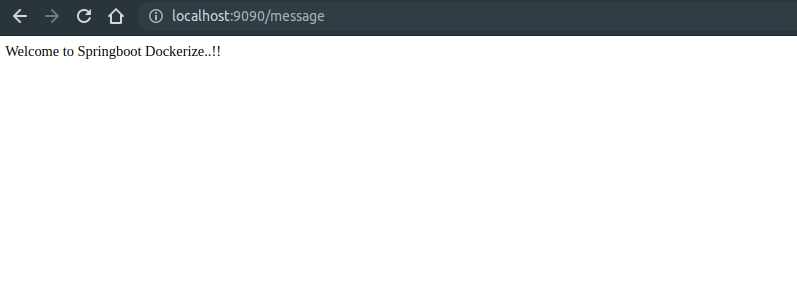

# spring-boot-dockerize
How to Dockerize Spring Boot Application 

### Step 1
mvn  clean install 

### Step 2
docker build -t spring-boot-docker:1.0 .

### Step 3
-- check if the image was created  spring-boot-docker            tag: 1.0
docker images   

### Step 4
docker run -p 9090:8080 spring-boot-docker:1.0

-- In the run command, we have specified that the port 8080 on the container should be mapped to the port 9090 on the Host OS.

### Step 5
-- Open Browser  http://localhost:9090/message

</img>

